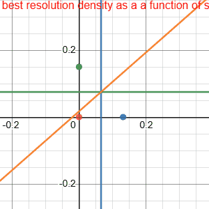
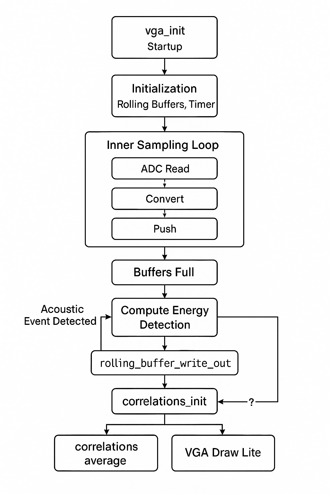

# 2. High-Level Design

## 2.1 Rationale & Inspiration

Audio localization typically depends on specialized DSP hardware or simplified methods that only work with sharp transients. This often makes such projects out of reach for hobbyists and also results in expensive systems.

By leveraging the Raspberry Pi Pico’s ADC along with the RP2040’s fast processors, we determined it was possible to implement a more sophisticated localization technique entirely on-chip.

We decided to implement a time-difference-of-arrival (TDOA) method to determine sound location. To compute the time difference between microphones, we use cross-correlations to estimate the likelihood of various sample shifts. As compared to FFT based approaches, this approach is significantely cheaper to compute. This approach allows us to localize many types of sounds quickly and accurately on the Pico.

## 2.2 Background Math

At standard temperature and pressure, the speed of sound is approximately \($343\,\mathrm{m/s}$\). This means that for every additional centimeter between microphones, the maximum travel time is:

$$
\frac{\text{distance}}{\text{velocity}}
= \frac{0.01\,\mathrm{m}}{343\,\mathrm{m/s}}
\approx 29.15\,\mu\mathrm{s}
$$

Due to discrete sampling, time-difference estimates are quantized by the ADC sample period and microphone spacing.

{: .bordered }

For example, sampling at \($100\,\mathrm{kHz}$\) \($10\,\mu\mathrm{s}$ per sample\) with an equilateral microphone triangle of \($10\,\mathrm{cm}$\) sides yields a maximum shift of about $\pm 30$ samples. Each pair of microphones then produces an integer shift in $\left[-30, +30\right]$ indicating their relative time difference.

With three microphones, there are roughly $61^3$ distinct shift combinations. Increasing the ADC rate or spacing the microphones farther apart increases resolution by allowing more distinct shifts.

### Cross Correlation
The cross correlation calculation makes up the core of our algorithm. Cross‑correlation is a sliding inner‑product that quantifies the similarity between two signals as one is shifted in time. The cross correlation operation is defined as 

$$ 
R_{xy}[k] \;=\;\sum_{n=-\infty}^{\infty} x[n]\,y[n + k]
$$

In our case, the cross correlation peaks at a point k which represents the point at which the signals overlap the most. This k effectively gives you the time difference of arrival between 2 microphones.

### Time Delay of Arrival (TDOA) Calculation
$$
t_{delay} = \frac{k_{max}}{f_s}. 
$$

Though we use a more complex version of this, the goal of our system is to find this k_max value to find the time shift between microphones. In our project, this k is represented by the best shift. We apply some smoothing and filtering techiques, but at its core, our project finds these shifts between the microphones and uses it to determine the audio source. 

### FFT Based-Approaches
To efficiently calculate the Time Difference of Arrival (TDOA) between two microphone signals, $x[n]$ and $y[n]$, using an FFT-based approach, the following steps are typically performed:

1.  **Compute Discrete Fourier Transforms (DFTs):**
    The DFTs of the windowed signal frames are calculated.
2.  **Form the (Weighted) Cross-Power Spectrum:**
    The cross-power spectrum $$ P_{xy}(\omega) = X(\omega) Y^*(\omega) $$ is computed, where $Y^*(\omega)$ is the complex conjugate of $Y(\omega)$. For improved robustness, especially in noisy or reverberant conditions, a weighting function is applied.
4.  **Compute Inverse DFT (IDFT):**
    The cross-correlation sequence $r_{xy}[k]$ in the time lag domain is obtained by taking the IDFT of $P_{xy}(\omega)$:
    This sequence represents the correlation between the two signals for various time lags $k$.
5.  **Identify Peak Lag:**
    The lag $k_{\text{max}}$ at which the cross-correlation sequence $r_{xy}[k]$ reaches its maximum value corresponds to the estimated time delay in samples:
    $$k_{\text{max}} = \underset{k}{\text{argmax}} \{r_{xy}[k]\}$$
    
The FFT approach leverages the convolution theorem, which states that convolution in the time domain equals multiplication in the frequency domain:

$$ x[n] * y[n] \Leftrightarrow X(f) \cdot Y(f) $$

This property transforms the computationally expensive $O(N^2)$ cross-correlation operation into an $O(N\log N)$ process. However, for our buffer size of $N=1024$, this theoretical advantage provided minimal practical speedup. More importantly, the FFT approach introduced additional complications: increased sensitivity to phase shifts from our filters and vulnerability to non-equivalent sampling times between our three microphones. One of the innovations of our project is to remove the need for the calculation of the FFT prior to taking the cross-correlation. So while these approaches operate in the frequency domain, we operate on the sampled microphone power level readings. 

### TDOA Conversion to Position
Once $\tau_{\text{delay}}$ is found between a pair of microphones, it implies that the sound source lies on a specific hyperboloid with the microphones as foci.
$$ c \cdot \tau_{\text{delay}} = d_2 - d_1 $$
where $c$ is the speed of sound, and $d_1, d_2$ are the distances from the source to microphone 1 and 2, respectively.
By using multiple microphone pairs, multiple TDOAs can be calculated, and the intersection of the corresponding hyperboloids gives an estimate of the sound source's location. For instance, with two microphones, the TDOA can give an angle of arrival (AOA) relative to the microphone axis. This approach is what is used in our implementation and also in many FFT-based systems. 

$$ 
R_{xy}[k] \;=\;\sum_{n=-\infty}^{\infty} x[n]\,y[n + k]
$$

In our case, the cross correlation peaks at a point k which represents the point at which the signals overlap the most.  

### Time Delay of Arrival (TDOA) Calculation
$$
t_{delay} = \frac{k_{max}}{f_s}. 
$$

Though we use a more complex version of this, the goal of our system is to find this k_max value to find the time shift between microphones. In our project, this k is represented by the best shift. We apply some smoothing and filtering techiques, but at its core, our project finds these shifts between the microphones and uses it to determine the audio source. 

### TDOA Conversion to Position
Once $\tau_{\text{delay}}$ is found between a pair of microphones, it implies that the sound source lies on a specific hyperboloid with the microphones as foci.
$$ c \cdot \tau_{\text{delay}} = d_2 - d_1 $$
where $c$ is the speed of sound, and $d_1, d_2$ are the distances from the source to microphone 1 and 2, respectively.
By using multiple microphone pairs, multiple TDOAs can be calculated, and the intersection of the corresponding hyperboloids gives an estimate of the sound source's location. For instance, with two microphones, the TDOA can give an angle of arrival (AOA) relative to the microphone axis. This approach is what is used in our implementation and also in many FFT-based systems. 
 
--- 
## 2.3 Logical Structure

{: .float-right }

The software pipeline on a single RP2040 core follows:

1. **DMA-driven sampling**  
   Configure the ADC in round-robin mode for three channels and set up a ping-pong DMA to fill a three-byte `dma_sample_array`.

2. **Rolling buffers**  
   The `sample_and_compute_loop()` function reads the DMA array at \($50\,\mathrm{kHz}$\), converts each $8$-bit sample to signed $16$-bit, and pushes them into three rolling buffers via `rolling_buffer_push()`.

3. **Event detection**  
   Once buffers are full, outgoing and incoming windowed power are compared. Crossing the threshold triggers processing.

4. **Cross-correlation**  
   Each buffer is flattened into a DC-centered frame and optionally windowed. `correlations_init()` scores integer sample shifts over the physically possible range.

5. **Best-shift computation**  
   The shift with the highest correlation score for each microphone pair is selected; `correlations_average()` exponentially smooths these over time.

6. **VGA rendering**  
   If any shift is nonzero, `vga_draw()` renders the full heatmap and waveforms. Otherwise, `vga_draw_lite()` updates only the latest curves and markers.

## 2.4 Hardware/Software Trade-Offs

Achieving \($50\,\mathrm{kHz}$\) sampling across three ADC channels on a Pico with \($264\,\mathrm{KB}$\) SRAM and \($133\,\mathrm{MHz}$\) cores required careful balancing:

- **DMA offload:** The DMA ensures jitter-free \($50\,\mathrm{kHz}$\) sampling without CPU interrupts.
- **Buffer size vs. compute time:** We experimented with buffer lengths up to $2048$ samples but settled on $1024$ to balance noise reduction and CPU load.
- **Display overhead:** Full heatmap draws are only on loud events; `vga_draw_lite()` handles most frames to stay within sampling deadlines.

## 2.5 Intellectual Property Landscape

Time-difference-of-arrival localization with cross-correlation is a long-standing, public-domain DSP technique. While specific microphone array patents exist, our breadboard layout and algorithms are original or derived from public-domain sources. We use no proprietary IP, no Altera/Intel cores, and abide by open-source licenses for any third-party code.
