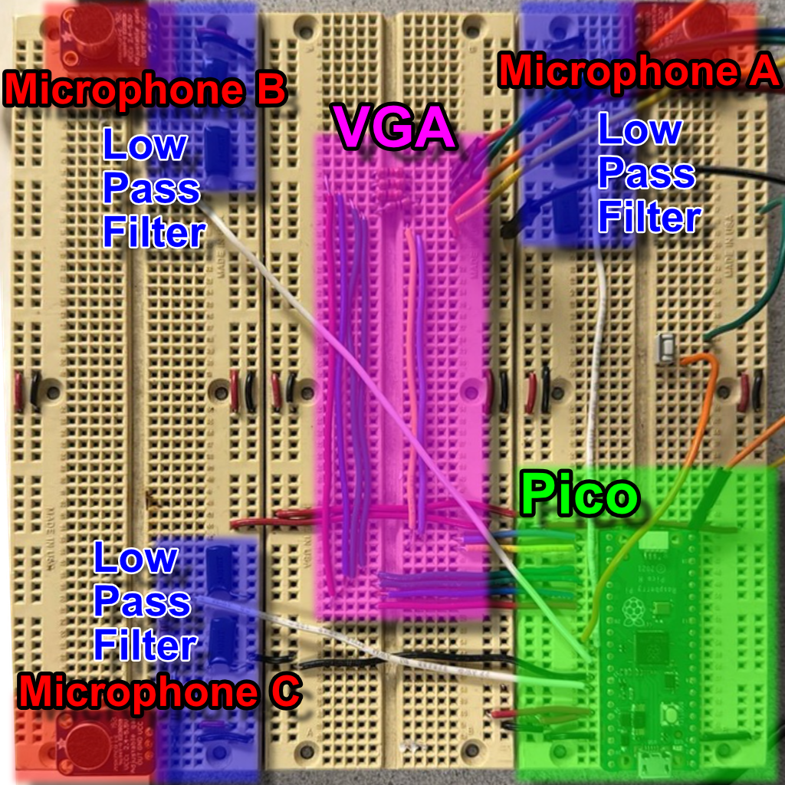

# 3. Program & Hardware Design

## 3.1 Hardware Design

{: .bordered }

We used three MAX4466 microphones at the corners of a breadboard forming a right triangle. Each mic’s output passes through a second-order \($20\,\mathrm{kHz}$\) low-pass filter to remove ultrasonic noise.

The filtered outputs connect to the Pico’s ADC channels `0`, `1`, and `2`. We minimized wiring length to reduce interference.

The provided VGA driver uses three PIO state machines and DMA:

- **HSYNC PIO:** Generates horizontal sync, front/back porches.
- **VSYNC PIO:** Counts lines via HSYNC interrupts and manages vertical timing.
- **RGB PIO:** Streams pixel data from a DMA-fed global pixel array (\($3$ bits per pixel\)).

A \($330\,\Omega$\) resistor in series (with the Pico’s internal \($70\,\Omega$\)) forms a divider to step the Pico’s \($3.3\,\mathrm{V}$\) GPIO down to \($0$–$0.7\,\mathrm{V}$\) safe for VGA inputs.

## 3.2 Core Software Loop

The heart of the system resides in the `sample_and_compute_loop()` function within `sample_compute.c`, which orchestrates audio capture, processing, and visualization. Upon startup, `vga_init()` prepares the display subsystem.

The loop initializes three rolling buffers—one per microphone—and records time for pacing. In the inner sampling loop, the code:

1. Reads $8$-bit ADC values from `dma_sample_array` for channels A, B, and C.
2. Converts them to signed $16$-bit samples.
3. Pushes them into the respective circular buffers with `rolling_buffer_push()`.

Once each buffer is full, outgoing and incoming power are computed. If the "outgoing" energy (older half of each buffer) exceeds twice the "incoming" energy (newer half), an acoustic event is detected and processing begins.

Each rolling buffer is then flattened into a DC-offset-normalized frame via `rolling_buffer_write_out()`. Pairwise cross-correlations (`correlations_init()`) determine sample-shift estimates. If any shift is nonzero, `correlations_average()` updates long-term averages, and `vga_draw()` runs; otherwise, `vga_draw_lite()` updates only waveforms and shift markers.

## 3.3 Rolling Buffer Algorithm

Circular buffering of the microphone streams is implemented in `rolling_buffer.c` using a fixed-size array of `BUFFER_SIZE` samples. Each call to `rolling_buffer_push()`:

1. Computes indices for the "outgoing" sample (current head) and the midpoint sample (head minus half the buffer, wrapped).
2. Updates four accumulators: `outgoing_total`, `outgoing_power`, `incoming_total`, and `incoming_power`.
3. Uses the `SAMPLE_POWER(sample)` macro for power tracking.
4. Overwrites the oldest sample, increments the head (wrapping at `BUFFER_SIZE`), and sets `is_full` after the first wrap.

When processing, `rolling_buffer_write_out()` copies samples into a contiguous `buffer_t`, subtracts the average (`dst_offset`), and computes total power for correlation normalization.

## 3.4 Cross-Correlation Module

The cross-correlation engine in `correlations.c` provides both instantaneous and smoothed time-delay estimates.

- **`correlations_init()`:**  
  For each integer shift `s` in [–`MAX_SHIFT_SAMPLES`, +`MAX_SHIFT_SAMPLES`], it computes the dot-product of two sample buffers offset by `s` and stores the 64-bit sum in `corr->correlations[s + MAX_SHIFT_SAMPLES]`. The `best_shift` is set to the highest-scoring `s`.

- **`correlations_average()`:**  
  Applies an exponential decay filter based on elapsed time, blends new correlation values into a long-term array, and recomputes `best_shift` on the smoothed data.

## 3.5 DMA-Driven Sampling

High-throughput ADC sampling is achieved in `dma_sampler.c`.

During `dma_sampler_init()`, the ADC is configured in round-robin mode for channels `0`, `1`, and `2` (GPIO26–28) with FIFO enabled and the clock divider set for maximum rate.

Two DMA channels are used:

1. **Sample channel:** Reads $8$-bit samples from the ADC FIFO into the three-byte `dma_sample_array`.
2. **Control channel:** Reloads the sample channel’s transfer pointer to form a continuous ping-pong cycle.

This yields a steady \($50\,\mathrm{kHz}$\) sampling rate with minimal jitter and zero CPU overhead beyond reading `dma_sample_array`.

## 3.6 Microphone Geometry & Calibration

In `microphones.c`, `microphones_init()` computes the array geometry:

1. Uses `MIC_DIST_AB_M`, `MIC_DIST_BC_M`, and `MIC_DIST_CA_M` with the law of cosines to determine coordinates for an uncentered triangle (A′ at $(0,0)$, B′ at $(d_{AB},0)$, C′ accordingly).
2. Finds the centroid of A′B′C′ and shifts all points so the center of mass is at the origin.
3. If `ROTATE_MICROPHONES` is enabled, rotates all points so microphone A aligns with the +X axis via a standard 2D rotation.

## 3.7 VGA Visualization

{: .bordered }

The display routines in `vga.c` layer multiple graphical elements:

- **`vga_init()`:** Calls `vga_init_heatmap()`, which draws axes and precomputes a heatmap lookup.
- **`vga_draw()`:** Renders correlation curves, overlays the heatmap of possible locations, and plots raw waveforms.
- **`vga_draw_lite()`:** Omits the heatmap and updates only markers and waveforms for low-latency frames.

Helper modules (`vga_correlations`, `vga_heatmap`, `vga_text`, `vga_waveforms`) use the `lib/vga/vga16_graphics` primitives to draw primitives based on correlation-derived color thresholds.

## 3.8 Third-Party & Reused Code

We build atop the official Raspberry Pi Pico SDK for multicore support, GPIO, ADC, DMA, and timing. The VGA stack uses the open-source `lib/vga/vga16_graphics` library. No proprietary IP or Altera cores are used. Math functions (`sqrtf`, `atan2f`, `exp`) come from standard C libraries. All custom modules—rolling buffers, correlation engine, DMA sampler, display routines—are authored in-house or derived from public-domain sources.
