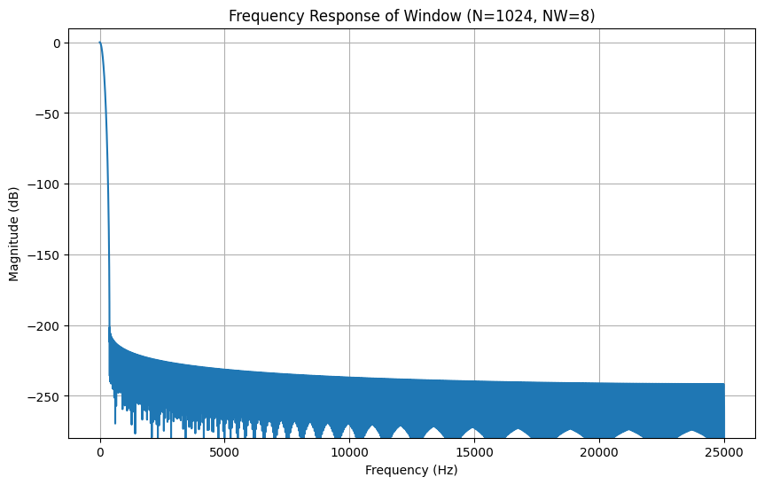
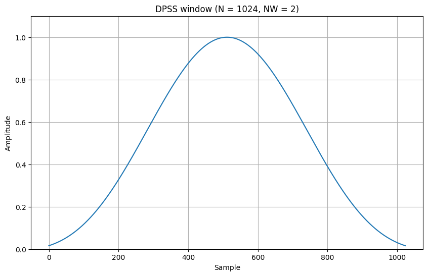

# 4. Things Tried That Didn’t Work

## 4.1 Aggressive Windowing Function

Early in development, we incorporated a Discrete Prolate Spheroidal Sequence (DPSS) analysis window via `buffer_window()` in `buffer.c`, multiplying each of the $256$ samples by a high-"NW" taper stored in `WINDOW_FUNCTION`.

Below is a plot of the original window function and its frequency response:

{: .bordered }
{: .bordered }

Analytically, it was intended to reduce spectral leakage before cross-correlation, but the $8$-bit ADC’s quantization noise dominated. The DPSS windowing added overhead without improving peak detection. We lowered the NW parameter significantly (flattening the window) and left the minimal window in place, relying on DC-offset removal for accuracy.

{: .bordered }
{: .bordered }

## 4.2 In-Plane Localization Methods

We initially attempted full "in-plane" localization—solving for $(x,y)$ on the microphone plane—by combining three pairwise time delays with multilateration routines in `microphones.c`.

{: .bordered }

While this worked for sources inside the triangle, it failed for sounds outside the array: hyperbolic delay curves intersected behind the microphones or at infinity.

We recognized the array’s strength in angular estimation (parallel wavefronts) over absolute distance. By switching to angles of arrival above the array—using $\pm$`MAX_SHIFT_SAMPLES` cross-correlation shifts—we achieved robust direction estimates even off-axis.

{: .bordered }

Assuming a height above the array, we accurately locate sources outside the triangle.
