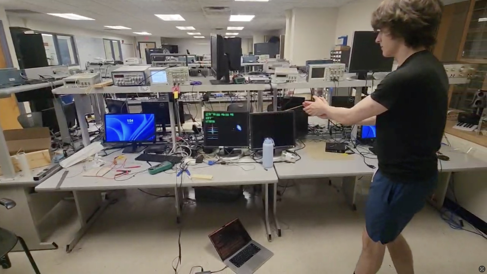
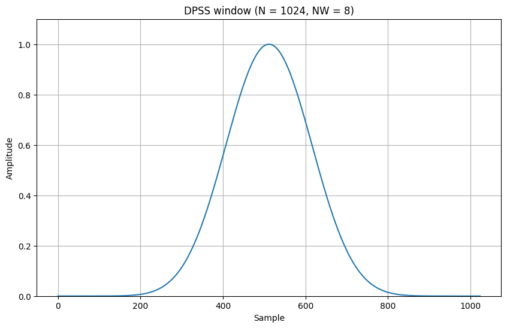
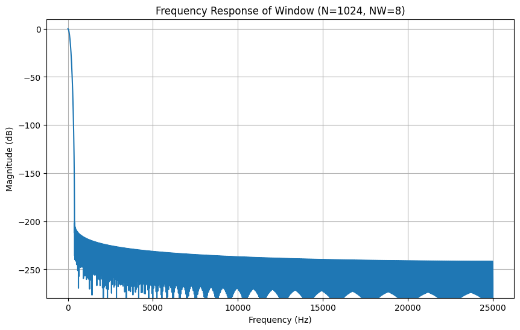
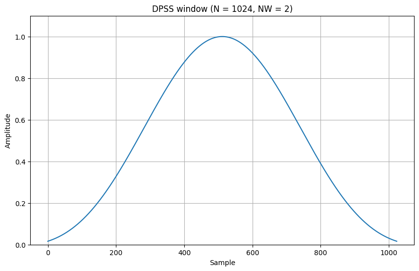
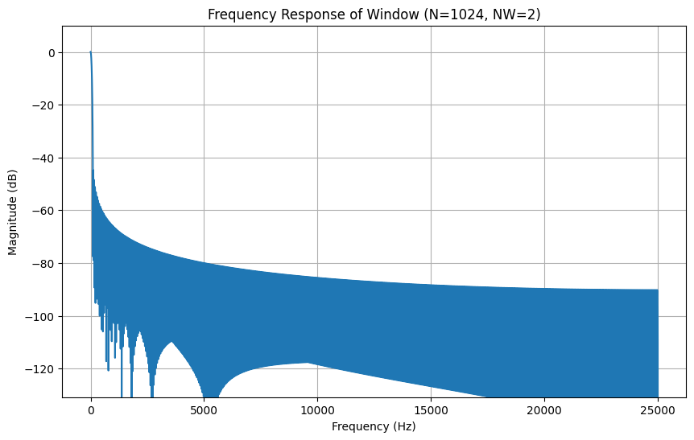
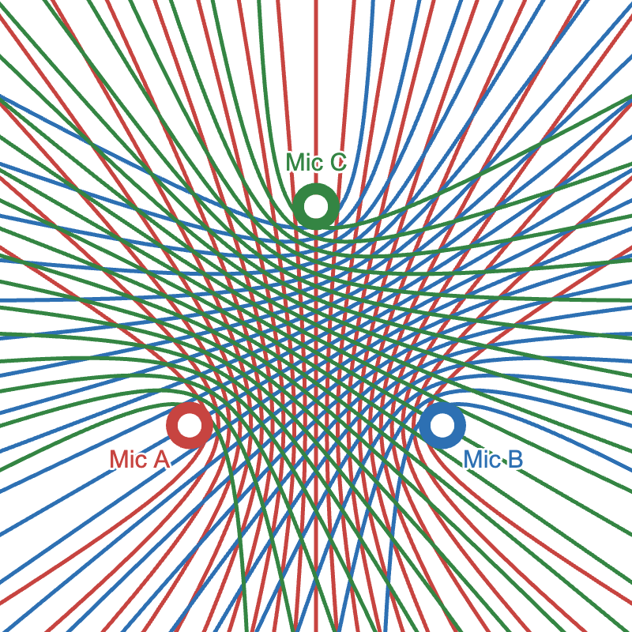
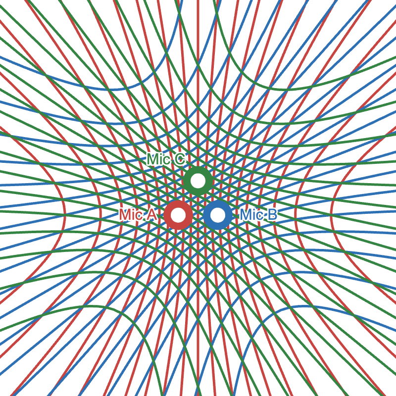

<link rel="stylesheet" href="./assets/css/custom.css">
<link rel="stylesheet" href="./assets/css/just-the-docs-default.css">

[Download latest ZIP](https://github.com/Sam-Belliveau/ece-4760-final-project/releases/latest/download/alk246_er495_srb343.zip)

# 0. Table of Contents

Click to Hide

1. TOC
{:toc}

---

# 1. Project Introduction

## 1.1 Sound bite

Our device listens with multiple "ears," using cross-correlation to instantly point you toward a sound’s origin.

_video goes here_

{: .bordered }

## 1.2 Summary

In this project, we designed a real-time sound localization system using a Raspberry Pi Pico and three microphones. Audio from each of the MEMS microphones was continuously sampled at \($50\,\mathrm{kHz}$\) via the Pico’s DMA engine.

Each channel’s data is then streamed into a rolling buffer. When the energy in the buffer reaches a certain threshold, the software performs cross-correlations between the microphone pairs to estimate the time differences between the audio arrivals.

These estimates are averaged over time to reduce the impact of noise. Using the delay estimates, a heat map is drawn by comparing the expected delays from each location to the estimates calculated by our cross-correlation.

The entire processing chain—from sampling to buffering, correlation, and VGA drawing—executes on the Raspberry Pi Pico.

## 1.3 Motivation

Our motivation was a combination of passion for signal processing and demonstrating the capabilities of low-cost hardware in audio processing. The localization system has many applications, from robotics to art installations.

The total cost of the microphones used is under $20, while the accuracy of the localization is comparable to much more expensive systems. The algorithms run purely in fixed-point math on the Pico, eliminating the need for a dedicated DSP chip. Combined with the Pico’s VGA output, this results in an all-in-one package for sound localization.

---

# 2. High-Level Design

## 2.1 Rationale & Inspiration

Audio localization typically depends on specialized DSP hardware or simplified methods that only work with sharp transients. This often makes such projects out of reach for hobbyists.

By leveraging the Raspberry Pi Pico’s ADC along with the RP2040’s fast processors, we determined it was possible to implement a more sophisticated localization technique entirely on-chip.

We decided to implement a time-difference-of-arrival (TDOA) method to determine sound location. To compute the time difference between microphones, we use cross-correlations to estimate the likelihood of various sample shifts. This approach allows us to localize many types of sounds quickly and accurately on the Pico.

## 2.2 Background Math

At standard temperature and pressure, the speed of sound is approximately \($343\,\mathrm{m/s}$\). This means that for every additional centimeter between microphones, the maximum travel time is:

$$
\frac{\text{distance}}{\text{velocity}}
= \frac{0.01\,\mathrm{m}}{343\,\mathrm{m/s}}
\approx 29.15\,\mu\mathrm{s}
$$

Due to discrete sampling, time-difference estimates are quantized by the ADC sample period and microphone spacing.

For example, sampling at \($100\,\mathrm{kHz}$\) \($10\,\mu\mathrm{s}$ per sample\) with an equilateral microphone triangle of \($10\,\mathrm{cm}$\) sides yields a maximum shift of about $\pm 30$ samples. Each pair of microphones then produces an integer shift in $\left[-30, +30\right]$ indicating their relative time difference.

With three microphones, there are roughly $61^3$ distinct shift combinations. Increasing the ADC rate or spacing the microphones farther apart increases resolution by allowing more distinct shifts.

## 2.3 Logical Structure

The software pipeline on a single RP2040 core follows:

1. **DMA-driven sampling**  
   Configure the ADC in round-robin mode for three channels and set up a ping-pong DMA to fill a three-byte `dma_sample_array`.

2. **Rolling buffers**  
   The `sample_and_compute_loop()` function reads the DMA array at \($50\,\mathrm{kHz}$\), converts each $8$-bit sample to signed $16$-bit, and pushes them into three rolling buffers via `rolling_buffer_push()`.

3. **Event detection**  
   Once buffers are full, outgoing and incoming windowed power are compared. Crossing the threshold triggers processing.

4. **Cross-correlation**  
   Each buffer is flattened into a DC-centered frame and optionally windowed. `correlations_init()` scores integer sample shifts over the physically possible range.

5. **Best-shift computation**  
   The shift with the highest correlation score for each microphone pair is selected; `correlations_average()` exponentially smooths these over time.

6. **VGA rendering**  
   If any shift is nonzero, `vga_draw()` renders the full heatmap and waveforms. Otherwise, `vga_draw_lite()` updates only the latest curves and markers.

## 2.4 Hardware/Software Trade-Offs

Achieving \($50\,\mathrm{kHz}$\) sampling across three ADC channels on a Pico with \($264\,\mathrm{KB}$\) SRAM and \($133\,\mathrm{MHz}$\) cores required careful balancing:

- **DMA offload:** The DMA ensures jitter-free \($50\,\mathrm{kHz}$\) sampling without CPU interrupts.
- **Buffer size vs. compute time:** We experimented with buffer lengths up to $2048$ samples but settled on $1024$ to balance noise reduction and CPU load.
- **Display overhead:** Full heatmap draws are only on loud events; `vga_draw_lite()` handles most frames to stay within sampling deadlines.

## 2.5 Intellectual Property Landscape

Time-difference-of-arrival localization with cross-correlation is a long-standing, public-domain DSP technique. While specific microphone array patents exist, our breadboard layout and algorithms are original or derived from public-domain sources. We use no proprietary IP, no Altera/Intel cores, and abide by open-source licenses for any third-party code.

---

# 3. Program & Hardware Design

## 3.1 Hardware Design

{: .bordered }

We used three MAX4466 microphones at the corners of a breadboard forming a right triangle. Each mic’s output passes through a second-order \($20\,\mathrm{kHz}$\) low-pass filter to remove ultrasonic noise.

The filtered outputs connect to the Pico’s ADC channels `0`, `1`, and `2`. We minimized wiring length to reduce interference.

The provided VGA driver uses three PIO state machines and DMA:

- **HSYNC PIO:** Generates horizontal sync, front/back porches.
- **VSYNC PIO:** Counts lines via HSYNC interrupts and manages vertical timing.
- **RGB PIO:** Streams pixel data from a DMA-fed global pixel array (\($3$ bits per pixel\)).

A \($330\,\Omega$\) resistor in series (with the Pico’s internal \($70\,\Omega$\)) forms a divider to step the Pico’s \($3.3\,\mathrm{V}$\) GPIO down to \($0$–$0.7\,\mathrm{V}$\) safe for VGA inputs.

## 3.2 Core Software Loop

Detail `sample_and_compute_loop()` in `sample_compute.c`, from buffer refilling through threshold-based activity detection to correlation and VGA draw.

The heart of the system resides in the `sample_and_compute_loop()` function within `sample_compute.c`, which orchestrates audio capture, processing, and visualization. Upon startup, `vga_init()` prepares the display subsystem.

The loop initializes three rolling buffers—one per microphone—and records time for pacing. In the inner sampling loop, the code:

1. Reads $8$-bit ADC values from `dma_sample_array` for channels A, B, and C.
2. Converts them to signed $16$-bit samples.
3. Pushes them into the respective circular buffers with `rolling_buffer_push()`.

Once each buffer is full, outgoing and incoming power are computed. If the "outgoing" energy (older half of each buffer) exceeds twice the "incoming" energy (newer half), an acoustic event is detected and processing begins.

Each rolling buffer is then flattened into a DC-offset-normalized frame via `rolling_buffer_write_out()`. Pairwise cross-correlations (`correlations_init()`) determine sample-shift estimates. If any shift is nonzero, `correlations_average()` updates long-term averages, and `vga_draw()` runs; otherwise, `vga_draw_lite()` updates only waveforms and shift markers.

## 3.3 Rolling Buffer Algorithm

Circular buffering of the microphone streams is implemented in `rolling_buffer.c` using a fixed-size array of `BUFFER_SIZE` samples. Each call to `rolling_buffer_push()`:

1. Computes indices for the "outgoing" sample (current head) and the midpoint sample (head minus half the buffer, wrapped).
2. Updates four accumulators: `outgoing_total`, `outgoing_power`, `incoming_total`, and `incoming_power`.
3. Uses the `SAMPLE_POWER(sample)` macro for power tracking.
4. Overwrites the oldest sample, increments the head (wrapping at `BUFFER_SIZE`), and sets `is_full` after the first wrap.

When processing, `rolling_buffer_write_out()` copies samples into a contiguous `buffer_t`, subtracts the average (`dst_offset`), and computes total power for correlation normalization.

## 3.4 Cross-Correlation Module

The cross-correlation engine in `correlations.c` provides both instantaneous and smoothed time-delay estimates.

- **`correlations_init()`:**  
  For each integer shift `s` in [–`MAX_SHIFT_SAMPLES`, +`MAX_SHIFT_SAMPLES`], it computes the dot-product of two sample buffers offset by `s` and stores the 64-bit sum in `corr->correlations[s + MAX_SHIFT_SAMPLES]`. The `best_shift` is set to the highest-scoring `s`.

- **`correlations_average()`:**  
  Applies an exponential decay filter based on elapsed time, blends new correlation values into a long-term array, and recomputes `best_shift` on the smoothed data.

## 3.5 DMA-Driven Sampling

High-throughput ADC sampling is achieved in `dma_sampler.c`.

During `dma_sampler_init()`, the ADC is configured in round-robin mode for channels `0`, `1`, and `2` (GPIO26–28) with FIFO enabled and the clock divider set for maximum rate.

Two DMA channels are used:

1. **Sample channel:** Reads $8$-bit samples from the ADC FIFO into the three-byte `dma_sample_array`.
2. **Control channel:** Reloads the sample channel’s transfer pointer to form a continuous ping-pong cycle.

This yields a steady \($50\,\mathrm{kHz}$\) sampling rate with minimal jitter and zero CPU overhead beyond reading `dma_sample_array`.

## 3.6 Microphone Geometry & Calibration

In `microphones.c`, `microphones_init()` computes the array geometry:

1. Uses `MIC_DIST_AB_M`, `MIC_DIST_BC_M`, and `MIC_DIST_CA_M` with the law of cosines to determine coordinates for an uncentered triangle (A′ at $(0,0)$, B′ at $(d_{AB},0)$, C′ accordingly).
2. Finds the centroid of A′B′C′ and shifts all points so the center of mass is at the origin.
3. If `ROTATE_MICROPHONES` is enabled, rotates all points so microphone A aligns with the +X axis via a standard 2D rotation.

## 3.7 VGA Visualization

{: .bordered }

The display routines in `vga.c` layer multiple graphical elements:

- **`vga_init()`:** Calls `vga_init_heatmap()`, which draws axes and precomputes a heatmap lookup.
- **`vga_draw()`:** Renders correlation curves, overlays the heatmap of possible locations, and plots raw waveforms.
- **`vga_draw_lite()`:** Omits the heatmap and updates only markers and waveforms for low-latency frames.

Helper modules (`vga_correlations`, `vga_heatmap`, `vga_text`, `vga_waveforms`) use the `lib/vga/vga16_graphics` primitives to draw primitives based on correlation-derived color thresholds.

## 3.8 Third-Party & Reused Code

We build atop the official Raspberry Pi Pico SDK for multicore support, GPIO, ADC, DMA, and timing. The VGA stack uses the open-source `lib/vga/vga16_graphics` library. No proprietary IP or Altera cores are used. Math functions (`sqrtf`, `atan2f`, `exp`) come from standard C libraries. All custom modules—rolling buffers, correlation engine, DMA sampler, display routines—are authored in-house or derived from public-domain sources.

---

# 4. Things Tried That Didn’t Work

## 4.1 Aggressive Windowing Function

Early in development, we incorporated a Discrete Prolate Spheroidal Sequence (DPSS) analysis window via `buffer_window()` in `buffer.c`, multiplying each of the $256$ samples by a high-"NW" taper stored in `WINDOW_FUNCTION`.

Below is a plot of the original window function and its frequency response:

{: .bordered }
{: .bordered }

Analytically, it was intended to reduce spectral leakage before cross-correlation, but the $8$-bit ADC’s quantization noise dominated. The DPSS windowing added overhead without improving peak detection. We lowered the NW parameter significantly (flattening the window) and left the minimal window in place, relying on DC-offset removal for accuracy.

{: .bordered }
{: .bordered }

## 4.2 In-Plane Localization Methods

We initially attempted full "in-plane" localization—solving for $(x,y)$ on the microphone plane—by combining three pairwise time delays with multilateration routines in `microphones.c`.

{: .bordered }

While this worked for sources inside the triangle, it failed for sounds outside the array: hyperbolic delay curves intersected behind the microphones or at infinity.

We recognized the array’s strength in angular estimation (parallel wavefronts) over absolute distance. By switching to angles of arrival above the array—using $\pm$`MAX_SHIFT_SAMPLES` cross-correlation shifts—we achieved robust direction estimates even off-axis.

{: .bordered }

Assuming a height above the array, we accurately locate sources outside the triangle.

---

# 5. Testing and Results of the Design

## 5.1 Test Data & Traces

<!-- Present oscilloscope captures of ADC sampling timing (`SAMPLE_PERIOD_US`), DMA triggers, and GPIO timing for debugging. -->

## 5.2 Performance Metrics

<!-- Report system latency from sound event to VGA update, CPU load during correlation, and achieved frame rate under full load. -->

Blah Blah blah…

## 5.3 Accuracy Metrics

<!-- Quantify localization error (e.g., $\pm X\,\mathrm{cm}$) across a test grid, stability of `best_shift` under varying SNR. -->

Blah Blah blah…

## 5.4 Safety & Robustness

<!-- Describe input voltage ranges on ADC pins, power-on sequencing, and any watchdog or error handling incorporated. -->

Blah Blah blah…

## 5.5 Usability Assessment

<!-- Reflect on calibration steps required, UI clarity on VGA, and ease of deploying to other Pico boards. -->

Blah Blah blah…

---

# 6. Conclusions

## 6.1 Design Evaluation & Lessons Learned

<!-- Analyze how results matched expectations, discuss potential improvements (e.g., fixed-point vs floating-point, faster PIO implementations). -->

Blah Blah blah…

## 6.2 Standards Compliance

<!-- Comment on adherence to VGA timing specs, Pico hardware guidelines, and DSP best practices. -->

Blah Blah blah…

---

# 7. Appendix A (Permissions)

## 7.1 Course Website Inclusion

The group approves this report for inclusion on the course website.

## 7.2 YouTube Channel Inclusion

The group approves the video for inclusion on the course YouTube channel.
